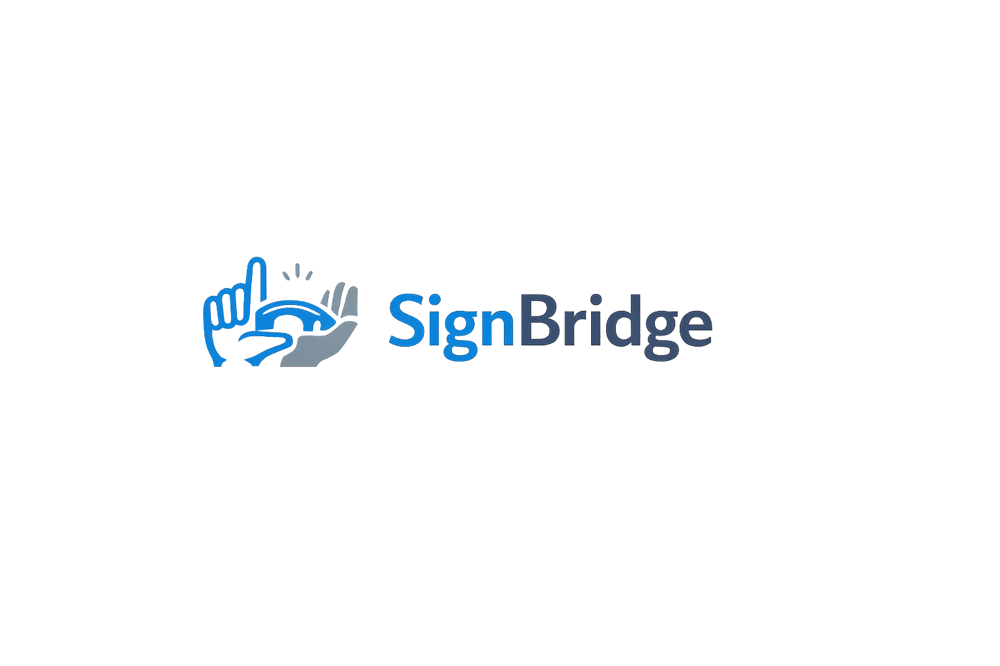

# 🤟 SignBridge

<div align="center">
  
  <p><strong>Bridging the gap between spoken language and sign language in real-time.</strong></p>

  [](https://nextjs.org/)
  [](https://tailwindcss.com/)
  [](https://www.typescriptlang.org/)
  [](https://www.framer.com/motion/)
  [](https://developers.google.com/mediapipe)
</div>

---

## 🌟 Introduction

**SignBridge** is a modern, accessible, and high-performance translation platform designed to break down communication barriers. By leveraging cutting-edge web technologies, including browser-native webcam APIs, **Google MediaPipe Hands**, and modern AI architectures, SignBridge translates American Sign Language (ASL) into written/spoken English—and vice versa—in real time.

The entire application features a premium, unified dark mode dashboard layout designed to run completely on a single viewport without vertical scrolling.

---

## ✨ Features

### 📹 Live ASL-to-Text Translator
- **Real-Time Landmark Recognition**: Implements MediaPipe hand tracking to map 21 standard coordinates per hand directly over the webcam feed.
- **Meet-Style Overlay Controls**: Interactive control bar overlays directly on the camera viewport (Start/Stop Video, Pause, Clear, Export Transcript).
- **Responsive Layout**: Designed as a single-screen dashboard space with 100% viewport locking to eliminate annoying scrolling.
- **Dynamic Confidence Indicators**: Renders real-time feedback with dynamic progress meters indicating AI prediction confidence.

### 🔠 Text-to-ASL Spell-Out
- **Letter-by-Letter Video Playback**: Smoothly translates text sentences into a continuous stream of ASL letter animations.
- **Chat-Style Sentence Builder**: Centered 80px chat input container for typing full phrases instantly.
- **A-Z Interactive Glossary Sidebar**: A compact sidebar keyboard layout that displays letter visuals.
- **Spring Active Key Framing**: Utilizing `framer-motion`'s shared layout layoutId transitions, a vibrant orange tracking background slides fluidly from letter to letter on the keyboard as the spelling animation plays in real time.

### 🎙️ Voice-to-ASL Translator
- **Web Speech API Recognition**: Listens to spoken words in real time with resilient error handling and automatic retry on silent pauses.
- **Transcription Waveforms**: Responsive audio level animation visualizers displaying microphone input levels.
- **Instant Letter Sequencing**: Auto-converts spoken results directly into ASL letter flows.

### 🔒 100% Offline, Private, and Account-Free
- **No Login / Account Restraints**: Completely free and guest-friendly out of the box. No login pages, pricing matrices, or usage bounds.
- **Local History Service**: Session logs and translations are stored and managed directly in your browser's local storage.

---

## 🛠️ Technology Stack

| Technology | Purpose | Key Advantages |
| :--- | :--- | :--- |
| **Next.js 16 (App Router)** | Framework | File-based App Router, React Server Components, and optimized static rendering. |
| **Tailwind CSS v4** | Styling | Next-gen PostCSS CSS-variable configurations (`@theme`) for instantaneous, highly responsive dark/light utility styles. |
| **Framer Motion 12** | Animation | Advanced physics-based spring transitions, layout animations, and entry effects. |
| **Google MediaPipe Hands** | ML Processing | Ultra-low latency CPU/GPU hand gesture classification directly inside standard browser environments. |
| **Radix UI** | Core Components | WAI-ARIA compliant accessible primitive building blocks (Dialog, Dropdown, Tabs, etc.). |
| **Zustand** | State Store | Light-weight reactive store for interface states, user preferences, and theme routing. |
| **Recharts** | Data Analytics | SVG chart widgets summarizing historical speed, accuracy, and vocabulary sizing metrics. |

---

## 📂 Project Architecture

```
SignBridge/
├── public/                 # Static visual assets (cropped logo, ASL letter videos A-Z)
├── scripts/                # Asset processing scripts (OpenCV cropping automation)
├── tfjs_model/             # Trained TensorFlow.js ASL recognition models
├── src/
│   ├── app/                # Next.js App Router route hierarchy
│   │   ├── (app)/          # Main dashboard routes (translator, text-to-sign, voice-to-sign)
│   │   ├── (marketing)/    # Minimalist marketing hero and accessibility info pages
│   │   └── layout.tsx      # Root template wrapping providers and styling
│   ├── components/         # Modular React Components
│   │   ├── landing/        # Landing page sections (Hero, Features, Testimonials)
│   │   ├── layout/         # Shell infrastructure (Sidebar, sticky TopNav, breadcrumbs)
│   │   └── ui/             # Reusable core primitive library (CVA Buttons, Inputs, Cards)
│   ├── hooks/              # Custom React utilities (Speech recognition, MediaPipe helpers)
│   ├── lib/                # Shared utilities (class merger cn, local history services)
│   └── store/              # App state managers (Zustand layout and theme stores)
```

---

## 🚀 Getting Started

Follow these steps to run the SignBridge dashboard locally on your development machine.

### 📋 Prerequisites
- Ensure you have **Node.js** (v18.x or later recommended) installed.
- Access to a modern web browser with a webcam.

### 🔧 Installation

1. **Clone the repository**:
   ```bash
   git clone https://github.com/Yashkush06/SignBridge.git
   cd SignBridge
   ```

2. **Install dependencies**:
   ```bash
   npm install
   ```

3. **Start the local development server**:
   ```bash
   npm run dev
   ```

4. **Open your browser**:
   Navigate to [http://localhost:3000](http://localhost:3000) to view the application in action.

---

## 💎 Design and Aesthetics

SignBridge adheres to strict, modern, and aesthetic design guidelines:
- **HSL Colors**: Tailored premium color palette utilizing high-contrast dark backgrounds and smooth interactive elements.
- **Glassmorphism**: Soft background blurs (`backdrop-blur-md`) with ultra-thin border dividing margins.
- **Dense Space**: High information density optimized for professional tooling without visual clutter.
- **Animations**: Highly responsive micro-interactions (e.g. spring hover scaling on A-Z keys, active sliding indicator overlays) to enrich user navigation.

---

## 📄 License
This project is open-source and free to distribute under the MIT License.
